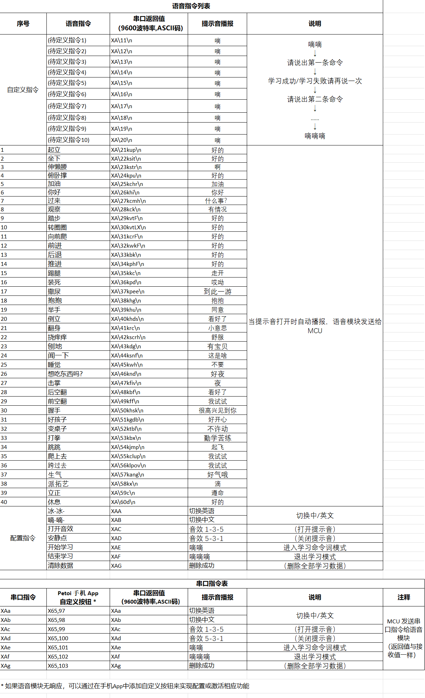
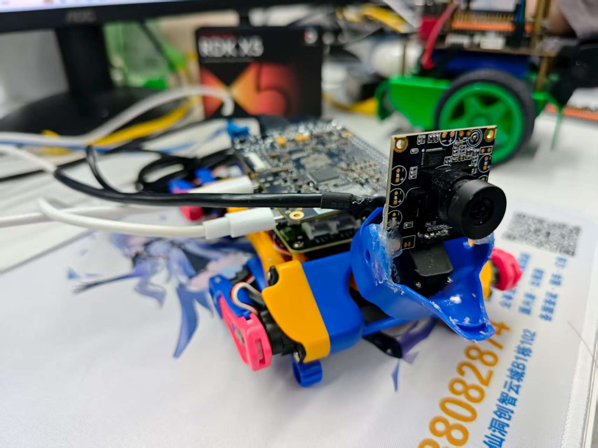

# BittleCoCo

# 一些说明
- colcon build --packages-select package_name
- （1）开机后自动发送XAd，该指令用于关闭回复音效并禁用反应.
- （2）开机后自动发送m0 0，该指令用于头部归位.
- （3）需要开启ros server服务，否则用VLM做的时候无法完成应答模式.


# Skills Reference




## server
```bash
root@ubuntu:~/ros2_ws# ros2 interface show opencat_msgs/srv/BaseTask 
uint8 cmd
int16[] arguments
float32 delay
---
bool res
```

## 常用测试命令

```bash
git add .
git commit -m "first commit"
git push -u origin main
ffplay -f v4l2 -i /dev/video0  # 播放摄像头
```

## 效果图
- 上位机：`RDK X5`
- 下位机：`BiBoard V1.0`


